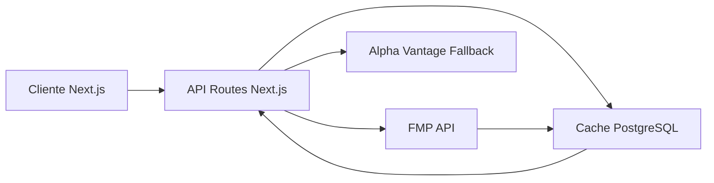

# 🚀 HolyBagger — Plan de Implementación

> Plataforma de análisis de nichos de inversión enfocada en activos multibagger (x5, x10+)

---

## 1. Visión General

**HolyBagger** es un screener inteligente que identifica acciones, ETFs y criptomonedas que han multiplicado su precio al menos 5x o 10x desde su cotización inicial, y que siguen activas en bolsa. La plataforma permite filtrar por tipo de activo, sector industrial (GICS), exchange y país (ADR), y ofrece un análisis detallado con gráficos interactivos e indicadores fundamentales.

### Objetivos del MVP
1. **Screener Multibagger** — Filtrar activos que hayan logrado multiplicaciones x5/x10+
2. **Vista Detallada** — Gráfico de precios con cálculo de revalorización dinámica
3. **Indicadores Fundamentales** — EPS, PEG, PE Forward, CAGR, ROIC, etc.
4. **Noticias** — Feed de noticias recientes del activo seleccionado

### Visión Futura
- Plataforma premium de análisis de **multibaggers por despegar** (pre-breakout)
- Suscripción de pago con análisis avanzados, alertas y reportes

---

## 2. Tech Stack

| Capa | Tecnología | Justificación |
|------|-----------|---------------|
| **Framework** | Next.js 14 (App Router) | SSR, API Routes, layouts anidados |
| **Estilos** | Tailwind CSS v3 | Solicitado por el usuario |
| **Charts** | Lightweight Charts (TradingView) | Profesional, ligero, interactivo |
| **Estado** | Zustand | Ligero, ideal para filtros/estado global |
| **Data Fetching** | TanStack Query (React Query) | Cache, revalidación, loading states |
| **UI Components** | Radix UI + custom | Accesibilidad + diseño premium |
| **Tipografía** | Inter (Google Fonts) | Moderna, legible, profesional |
| **Iconos** | Lucide React | Consistente, tree-shakeable |
| **API Financiera** | Financial Modeling Prep (FMP) | Screener, fundamentals, históricos, noticias |
| **API Backup** | Alpha Vantage / Finnhub | Fallback y datos complementarios |
| **Base de Datos** | PostgreSQL (Supabase) | Cache de datos, perfiles de usuario (futuro) |
| **ORM** | Prisma | Type-safe, migraciones |
| **Despliegue** | Vercel | Integración nativa con Next.js |

---

## 3. Arquitectura de Datos

### 3.1 APIs Financieras — Financial Modeling Prep (FMP)



**Endpoints FMP a utilizar:**

| Endpoint | Propósito |
|----------|-----------|
| `/v3/stock-screener` | Filtrar por sector, market cap, exchange, country |
| `/v3/historical-price-full/{symbol}` | Precios históricos OHLCV |
| `/v3/profile/{symbol}` | Perfil empresa (sector, industry, IPO date) |
| `/v3/key-metrics/{symbol}` | ROIC, PE, PEG, etc. |
| `/v3/income-statement/{symbol}` | Revenue, EPS histórico |
| `/v3/analyst-estimates/{symbol}` | EPS forward, growth estimates |
| `/v3/stock_news` | Noticias por símbolo |
| `/v3/etf/list` | Listado de ETFs |

### 3.2 Lógica Multibagger

```
Multiplicación = Precio Actual / Precio Mínimo Histórico (o IPO price)

Si Multiplicación >= Filtro seleccionado (5x, 10x, 20x, 50x, 100x):
    → Incluir en resultados
```

> [!IMPORTANT]
> El precio de IPO no siempre está disponible. Se usará el precio más antiguo disponible en datos históricos como proxy. Para mayor precisión, se complementará con el campo `ipoDate` del endpoint `/v3/profile`.

### 3.3 Estrategia de Cache

- **Datos de screener:** Cache en DB con TTL de 24h (los fundamentals no cambian minuto a minuto)
- **Precios históricos:** Cache con TTL de 1h para el día actual, permanente para históricos
- **Noticias:** Sin cache (siempre frescas)
- **Perfiles de empresa:** Cache con TTL de 7 días

---

## 4. Esquema de Base de Datos (Prisma)

```prisma
model Asset {
  id              String   @id @default(cuid())
  symbol          String   @unique
  name            String
  type            AssetType
  exchange        String   // NYSE, NASDAQ
  sector          String?
  industry        String?
  country         String?
  ipoDate         DateTime?
  marketCap       Float?
  currentPrice    Float?
  allTimeLow      Float?
  ipoPrice        Float?
  multiplication  Float?   // currentPrice / lowest historical price
  updatedAt       DateTime @updatedAt
  createdAt       DateTime @default(now())

  metrics         AssetMetrics?
  priceHistory    PriceHistory[]
}

model AssetMetrics {
  id              String   @id @default(cuid())
  assetId         String   @unique
  asset           Asset    @relation(fields: [assetId], references: [id])
  epsCurrentYear  Float?
  epsNextYear     Float?
  epsNext5Year    Float?
  peForward       Float?
  peg             Float?
  cagrPast5       Float?   // Revenue CAGR últimos 5 años
  cagrFuture5     Float?   // Revenue CAGR estimado próximos 5 años
  revenue         Float?
  roic            Float?
  roe             Float?
  debtToEquity    Float?
  updatedAt       DateTime @updatedAt
}

model PriceHistory {
  id        String   @id @default(cuid())
  assetId   String
  asset     Asset    @relation(fields: [assetId], references: [id])
  date      DateTime
  open      Float
  high      Float
  low       Float
  close     Float
  volume    BigInt
  @@unique([assetId, date])
}

enum AssetType {
  STOCK
  ETF
  CRYPTO
}
```

---

## 5. Estructura del Proyecto

```
holybagger/
├── app/
│   ├── layout.tsx                    # Root layout (dark theme, fonts)
│   ├── page.tsx                      # Landing → Screener principal
│   ├── globals.css                   # Tailwind + custom CSS
│   │
│   ├── screener/
│   │   └── page.tsx                  # Screener con filtros y resultados
│   │
│   ├── asset/
│   │   └── [symbol]/
│   │       └── page.tsx              # Vista detallada del activo
│   │
│   └── api/
│       ├── screener/
│       │   └── route.ts              # GET — buscar multibaggers
│       ├── asset/
│       │   └── [symbol]/
│       │       ├── route.ts          # GET — perfil + métricas
│       │       ├── history/
│       │       │   └── route.ts      # GET — precios históricos
│       │       └── news/
│       │           └── route.ts      # GET — noticias
│       └── sectors/
│           └── route.ts              # GET — lista de sectores
│
├── components/
│   ├── layout/
│   │   ├── Navbar.tsx                # Barra superior
│   │   ├── Sidebar.tsx               # Sidebar con categorías/filtros
│   │   └── Footer.tsx
│   │
│   ├── screener/
│   │   ├── FilterPanel.tsx           # Panel de filtros (tipo, sector, x, país)
│   │   ├── MultiplierSelector.tsx    # Selector x5, x10, x20...
│   │   ├── AssetTypeFilter.tsx       # Tabs: Acciones, ETFs, Crypto
│   │   ├── SectorFilter.tsx          # Dropdown sectores GICS
│   │   ├── CountryFilter.tsx         # Dropdown países ADR
│   │   ├── ExchangeFilter.tsx        # NYSE / NASDAQ
│   │   └── ResultsTable.tsx          # Tabla de resultados
│   │
│   ├── asset/
│   │   ├── PriceChart.tsx            # Gráfico Lightweight Charts
│   │   ├── MultiplierOverlay.tsx     # Overlay de multiplicación en gráfico
│   │   ├── TimeRangeSelector.tsx     # Selector de punto temporal
│   │   ├── FundamentalsCard.tsx      # Tarjeta de indicadores
│   │   ├── NewsPanel.tsx             # Panel de noticias
│   │   └── AssetHeader.tsx           # Header con nombre, símbolo, precio
│   │
│   └── ui/
│       ├── Badge.tsx
│       ├── Card.tsx
│       ├── Select.tsx
│       ├── Button.tsx
│       ├── Skeleton.tsx
│       └── Tooltip.tsx
│
├── lib/
│   ├── api/
│   │   ├── fmp.ts                    # Cliente Financial Modeling Prep
│   │   └── alpha-vantage.ts          # Cliente fallback
│   ├── db/
│   │   └── prisma.ts                 # Prisma client singleton
│   ├── utils/
│   │   ├── calculations.ts           # Cálculos de multiplicación, CAGR
│   │   └── formatters.ts             # Formateo de números, fechas
│   ├── constants/
│   │   ├── sectors.ts                # 11 sectores GICS
│   │   ├── countries.ts              # Países con ADR
│   │   └── exchanges.ts              # NYSE, NASDAQ
│   └── stores/
│       └── screener-store.ts         # Zustand store para filtros
│
├── prisma/
│   ├── schema.prisma
│   └── seed.ts                       # Seed de sectores/países
│
├── public/
│   └── images/
│
├── tailwind.config.ts
├── next.config.js
├── tsconfig.json
├── package.json
└── .env.local
```

---

## 6. Diseño UI/UX

### 6.1 Sistema de Diseño

Inspirado en la captura (GeminiAppHunt) — tema **dark premium** con acentos verdes:

| Token | Valor |
|-------|-------|
| `bg-primary` | `#0a0a0a` (fondo principal) |
| `bg-secondary` | `#141414` (cards, sidebar) |
| `bg-tertiary` | `#1e1e1e` (hover, inputs) |
| `border-subtle` | `#2a2a2a` |
| `text-primary` | `#f5f5f5` |
| `text-secondary` | `#a0a0a0` |
| `accent-green` | `#22c55e` (multibagger positivo) |
| `accent-emerald` | `#10b981` (badges, CTAs) |
| `accent-red` | `#ef4444` (negativo) |
| `accent-amber` | `#f59e0b` (warnings, neutral) |
| `accent-blue` | `#3b82f6` (links, info) |

### 6.2 Páginas Principales

#### Página 1: Screener (Home)

```
┌─────────────────────────────────────────────────────────┐
│  🚀 HolyBagger    [Search...]    Screener   About   💎  │
├──────────┬──────────────────────────────────────────────┤
│          │                                              │
│ FILTROS  │   🏆 Multibagger Screener                    │
│          │   Descubre activos que multiplicaron su valor │
│ Tipo     │                                              │
│ ○ All    │   ┌─────┬─────┬──────┬──────┬───────┐       │
│ ○ Stocks │   │ x5  │ x10 │ x20  │ x50  │ x100  │       │
│ ○ ETFs   │   └─────┴─────┴──────┴──────┴───────┘       │
│ ○ Crypto │                                              │
│          │   ┌──────────────────────────────────────┐   │
│ Sector   │   │ Symbol  Name     Sector   x    Price │   │
│ [▼ All]  │   │ NVDA    NVIDIA   Tech    x285  $130  │   │
│          │   │ AAPL    Apple    Tech    x580  $198  │   │
│ Exchange │   │ MELI    MercadoL Cons.D  x95   $1850 │   │
│ [▼ All]  │   │ TSLA    Tesla    Cons.D  x190  $245  │   │
│          │   │ ...                                   │   │
│ País ADR │   └──────────────────────────────────────┘   │
│ [▼ All]  │                                              │
│          │   Mostrando 47 de 312 resultados              │
│ Mult.    │   [1] [2] [3] ... [7]                        │
│ [▼ x10]  │                                              │
│          │                                              │
└──────────┴──────────────────────────────────────────────┘
```

**Características clave:**
- Sidebar fijo con filtros colapsables
- Tabla de resultados con sorting por columna
- Cada fila clickeable → navega a `/asset/[symbol]`
- Badge de color para el multiplicador (verde x5-x10, esmeralda x10-x50, dorado x50+)
- Búsqueda por nombre o símbolo
- Paginación

#### Página 2: Detalle del Activo (`/asset/[symbol]`)

```
┌─────────────────────────────────────────────────────────┐
│  🚀 HolyBagger    [Search...]    Screener   About   💎  │
├─────────────────────────────────────────────────────────┤
│                                                         │
│  ← Volver    NVDA  NVIDIA Corporation                   │
│  Information Technology  │  NASDAQ  │  🇺🇸 USA           │
│  $130.25  ▲ +2.4%    Market Cap: $3.2T                  │
│                                                         │
│  ┌─────────────────────────────────────────────────┐    │
│  │              📈 GRÁFICO DE PRECIOS               │    │
│  │                                                  │    │
│  │    ╱╲    ╱╲╱╲                  ╱╲                │    │
│  │   ╱  ╲  ╱    ╲    ╱╲         ╱  ╲   ╱╲╱╲       │    │
│  │  ╱    ╲╱      ╲  ╱  ╲       ╱    ╲ ╱    ╲╱╲    │    │
│  │ ╱               ╲╱    ╲    ╱      ╲        ╲   │    │
│  │╱                        ╲╱                      │    │
│  │                                                  │    │
│  │  IPO: $0.46 → HOY: $130.25  = x283 🚀           │    │
│  │  📌 Click para seleccionar punto inicial         │    │
│  │                                                  │    │
│  │  [1M] [3M] [6M] [1Y] [5Y] [MAX]                │    │
│  └─────────────────────────────────────────────────┘    │
│                                                         │
│  ┌──────────────────┐  ┌──────────────────────────┐    │
│  │ 📊 FUNDAMENTALES  │  │ 📰 ÚLTIMAS NOTICIAS      │    │
│  │                   │  │                           │    │
│  │ EPS Next Year  +25%│ │ • NVIDIA beats Q3...     │    │
│  │ EPS Next 5Y   +30%│  │ • AI demand drives...    │    │
│  │ PE Forward    28.5│  │ • New chip announced...  │    │
│  │ PEG           0.95│  │ • Partnership with...    │    │
│  │ CAGR Rev 5Y   +45%│  │                           │    │
│  │ Revenue      $80B │  │                           │    │
│  │ ROIC         55.2%│  │                           │    │
│  │ Market Cap   $3.2T│  │                           │    │
│  └──────────────────┘  └──────────────────────────┘    │
└─────────────────────────────────────────────────────────┘
```

**Características del gráfico:**
- **Lightweight Charts** de TradingView para renderizado profesional
- Línea de referencia desde el precio de IPO/mínimo histórico
- **Overlay de multiplicación**: muestra "x283" como badge flotante
- **Selector de punto temporal**: click en cualquier punto del gráfico → recalcula la multiplicación desde ese punto
- Rangos de tiempo: 1M, 3M, 6M, 1Y, 5Y, MAX
- Tooltip con precio, fecha y multiplicación al hacer hover

---

## 7. API Routes — Detalle

### `GET /api/screener`

```typescript
// Query params:
{
  type?: 'STOCK' | 'ETF' | 'CRYPTO'
  sector?: string          // GICS sector
  exchange?: string        // NYSE | NASDAQ
  country?: string         // Country code (AR, BR, CN...)
  minMultiplier?: number   // 5, 10, 20, 50, 100
  page?: number
  limit?: number           // default 20
  sortBy?: string          // multiplication, marketCap, name
  sortOrder?: 'asc' | 'desc'
}

// Response:
{
  results: Asset[]
  total: number
  page: number
  totalPages: number
}
```

**Flujo interno:**
1. Verificar cache en DB (< 24h)
2. Si no hay cache → llamar FMP Stock Screener API
3. Para cada resultado, calcular multiplicación vs precio histórico mínimo
4. Filtrar por `minMultiplier`
5. Guardar en DB como cache
6. Retornar paginado

### `GET /api/asset/[symbol]`

Retorna perfil completo + métricas fundamentales.

### `GET /api/asset/[symbol]/history`

Retorna precios históricos con query param `range` (1m, 3m, 6m, 1y, 5y, max).

### `GET /api/asset/[symbol]/news`

Retorna últimas 10-20 noticias del activo.

---

## 8. Constantes de Referencia

### Sectores GICS (S&P 500)

```typescript
export const GICS_SECTORS = [
  'Energy',
  'Materials',
  'Industrials',
  'Consumer Discretionary',
  'Consumer Staples',
  'Health Care',
  'Financials',
  'Information Technology',
  'Communication Services',
  'Utilities',
  'Real Estate',
] as const;
```

### Países con ADR en EEUU

```typescript
export const ADR_COUNTRIES = [
  { code: 'AR', name: 'Argentina' },
  { code: 'BR', name: 'Brazil' },
  { code: 'CL', name: 'Chile' },
  { code: 'CN', name: 'China' },
  { code: 'CO', name: 'Colombia' },
  { code: 'DE', name: 'Germany' },
  { code: 'FR', name: 'France' },
  { code: 'GB', name: 'United Kingdom' },
  { code: 'IN', name: 'India' },
  { code: 'IL', name: 'Israel' },
  { code: 'JP', name: 'Japan' },
  { code: 'KR', name: 'South Korea' },
  { code: 'MX', name: 'Mexico' },
  { code: 'NL', name: 'Netherlands' },
  { code: 'PE', name: 'Peru' },
  { code: 'TW', name: 'Taiwan' },
  { code: 'ZA', name: 'South Africa' },
  // + más según disponibilidad en FMP
] as const;
```

---

## 9. Roadmap de Desarrollo

### Fase 1 — Fundación (Semana 1)
- [ ] Inicializar proyecto Next.js + Tailwind v3
- [ ] Configurar diseño base: layout dark, tipografía Inter, tokens de color
- [ ] Configurar Prisma + PostgreSQL (Supabase)
- [ ] Crear cliente FMP API (`lib/api/fmp.ts`)
- [ ] Implementar constantes (sectores, países, exchanges)
- [ ] Componentes UI base: Button, Card, Badge, Select, Skeleton

### Fase 2 — Screener (Semana 2)
- [ ] API Route `/api/screener` con lógica de cache
- [ ] API Route `/api/sectors`
- [ ] Componente `FilterPanel` con todos los filtros
- [ ] Componente `ResultsTable` con sorting y paginación
- [ ] Store Zustand para estado de filtros
- [ ] Integración TanStack Query para data fetching
- [ ] Página Screener completa

### Fase 3 — Vista Detallada (Semana 3)
- [ ] API Route `/api/asset/[symbol]` (perfil + métricas)
- [ ] API Route `/api/asset/[symbol]/history`
- [ ] API Route `/api/asset/[symbol]/news`
- [ ] Componente `PriceChart` con Lightweight Charts
- [ ] Overlay de multiplicación en gráfico
- [ ] Selector de punto temporal interactivo (click en gráfico → recalcula x)
- [ ] Componente `FundamentalsCard`
- [ ] Componente `NewsPanel`
- [ ] Página de detalle completa

### Fase 4 — Pulido (Semana 4)
- [ ] Animaciones y transiciones (Framer Motion)
- [ ] Responsive design (mobile-first)
- [ ] SEO: meta tags, Open Graph, structured data
- [ ] Error handling robusto y loading states
- [ ] Rate limiting en API routes
- [ ] Tests E2E básicos
- [ ] Deploy a Vercel

### Fase 5 — Futuro (Post-MVP)
- [ ] Autenticación (NextAuth / Clerk)
- [ ] Módulo premium: "Multibaggers por Despegar"
- [ ] Alertas por email/push
- [ ] Watchlists personalizadas
- [ ] Comparador de activos
- [ ] Integración con más APIs (Finnhub para sentiment)
- [ ] Stripe para suscripciones

---

## 10. Variables de Entorno

```env
# .env.local
FMP_API_KEY=your_fmp_api_key
ALPHA_VANTAGE_API_KEY=your_alpha_vantage_key  # fallback

DATABASE_URL=postgresql://...@supabase...
DIRECT_URL=postgresql://...@supabase...       # Prisma migrations

NEXT_PUBLIC_APP_URL=http://localhost:3000
```

---

## 11. Dependencias Clave

```json
{
  "dependencies": {
    "next": "^14.2",
    "react": "^18.3",
    "tailwindcss": "^3.4",
    "@radix-ui/react-select": "^2.0",
    "@radix-ui/react-tooltip": "^1.0",
    "@radix-ui/react-tabs": "^1.0",
    "@tanstack/react-query": "^5.0",
    "zustand": "^4.5",
    "lightweight-charts": "^4.1",
    "lucide-react": "^0.400",
    "@prisma/client": "^5.0",
    "framer-motion": "^11.0",
    "date-fns": "^3.6"
  },
  "devDependencies": {
    "prisma": "^5.0",
    "typescript": "^5.4",
    "@types/react": "^18",
    "@types/node": "^20"
  }
}
```

---

## 12. Riesgos y Mitigaciones

| Riesgo | Impacto | Mitigación |
|--------|---------|------------|
| Límite 250 req/día FMP free | Alto | Cache agresivo en DB + batch processing nocturno |
| Datos históricos limitados a 5 años (free) | Medio | Upgrade a plan Starter ($14/mes) para 30+ años |
| IPO price no siempre disponible | Medio | Usar precio más antiguo disponible como proxy |
| Rate limiting excesivo en producción | Alto | Implementar queue de requests + cache multi-capa |
| Crypto data inconsistente | Bajo | Usar CoinGecko como fuente complementaria para crypto |

> [!TIP]
> **Recomendación:** Para producción real, considerar el plan **Starter de FMP ($14/mes)** que ofrece 300 req/min y 30+ años de datos históricos. Esto es esencial para calcular multiplicaciones precisas desde IPO en empresas como Apple (IPO 1980) o Microsoft (IPO 1986).
